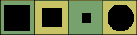
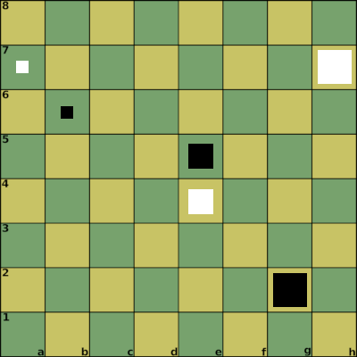
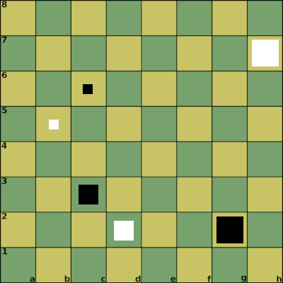
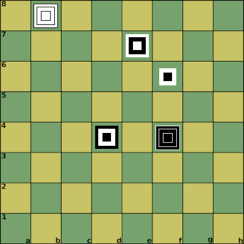
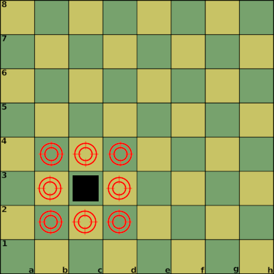
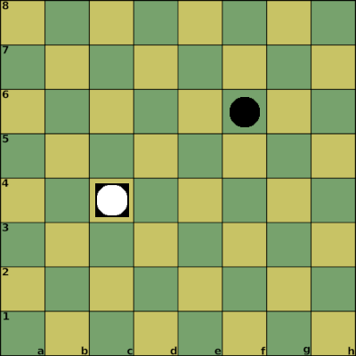

[Back](https://binary-station.github.io)

 
## Nerva manual  

# Nerva

by Afrasinei Alexandru Iulian

## Introduction

Nerva is a board game that utilizes a standard chess board and 192 pawns + 2 kings.

Two opposing forces (White and Black) face each other in battle on the game board.

It is a turn-based wargame in the spirit of chess with different rules.

The goal is to capture the enemy king.

## The elements of Nerva

* one chess board (8x8)

* White

   * Piece shapes
     
       Pawns (Boxes), King (Cylinder)

        
    
    * 96 White pawns
        * 32 large pawns
        * 32 medium pawns
        * 32 small pawns

    * the White king

* Black

    * Piece shapes

        Pawns (Boxes), King (Cylinder)

        

    * 96 Black pawns
        * 32 large pawns
        * 32 medium pawns
        * 32 small pawns

    * the Black king

## The board

A standard chess board (8x8).

### The battle environment

A maximum of 3 pawns can be placed on top of each other anywhere on the board.

Think of the board as 3 stacked boards on top of each other.

### Game notation

Chess notation is used to identify board locations.

This is extended for Nerva by using the following syntax to identify the stacked boards:

[row][column]_[board] - A pawn is placed on the board.

* [row]
  
  From a to h

* [column]

    From 1 to 8

* [board]

    From 1 to 3

    Board 1 is the normal chess board

    This is how we identify the pieces on the 3 stacked boards

[K]_[row][column]_[board] - King reveal.

[-K]_[row][column]_[board] - King is captured, game over.

Examples:

* Notation:

 1. h7_1 2. g2_1 3. e4_2 4. e5_2 5. a7_3 6. b6_3

## The pieces

### The pawns

On a board tile, stack the pieces in this order: Large pawn, Medium pawn, Small pawn.

Thinking in terms of stacked boards:

Board 1 uses the large pawns, board 2 uses the medium pawns, and board 3 uses the small pawns.

Examples:

* Notation:

1. d2_2 2. c3_2 3. h7_1 4. g2_1 5. b5_3 6.c6_3

* Notation:

1. b8_1 2. f4_1 3. b8_2 4. f4_2 5. b8_3 6. f4_3 7. f6_2 8. f6_3 9. e7_3 10. e7_2 11. e7_1 12. d4_1 13. d4_2 14. d4_3

#### White

96 pawns and the white king.

#### Black

96 pawns and the black king.

#### Properties

Each pawn has 1 attack point and 1 defense point.

If a pawn is at c3, the adjacent tiles are:

b2 c2 d2 d3 d4 b4 c4 b3

The attack and defense will happen on these adjacent tiles.

More details in the rules of defending, attacking, stacking sections. 

### The king

The king has no attack/defense points.

## The rules of placement

### Setup

The game starts with an empty board.

Each player gets their 96 pawns and their king.

The White player places the first pawn on the board. 

The pawns can be placed on any empty tile.

A maximum of 3 pawns can be stacked on a tile.

### King location

The king's location is hidden from the enemy player.

Each player decides at the beginning where their king will be located and keeps the information to themselves.

The chosen location can by anywhere on the 3 boards, use the game notation.

Each player will write the position on a piece of paper.

When a player places a pawn on the king position the king will be revealed.

The player will place his king on the board.

Example:

Both kings are revealed.

* Notation:

1. K_c4_2 2. K_f6_1

### Game started

The White player places a pawn, and then the players take turns placing pawns.

The game is over when one king is captured or all pawns are placed. 

## The rules of defending

A pawn will add a defense point to all adjacent friendly pawns (or king).

Example:

If a pawn is at c3, the adjacent tiles are:

b2 c2 d2 d3 d4 b4 c4 b3

Any friendly pawn on these positions will receive an additional defense point from the c3 pawn.

## The rules of attacking

A pawn will add an attack point to all adjacent enemy pawns (or king).

Adjacent enemy pawns can be attacked.

An attack will be declared by the player, each attack takes a turn.

If the attack points are higher than the defense points on a particular pawn, the attack will be successful.

The pawn will be removed from the board and replaced by another pawn from the attacker.

If you make a mistake and make an unsuccessful attack, the turn will change.

## The rules of stacking

When 3 pawns from the same player occupy the same position on all 3 boards (a stack of 3 pawns), then each receives 3 defense points and 3 attack points.

When such a stack is formed, the existing pawn attack/defense points will be replaced with 3.

There is no addition of existing points, so be careful with this.

Example:

c3_1 c3_2 c3_3

## Goal 

The goal is to reveal and capture the enemy king.

## Credits, contact

Afrasinei Alexandru Iulian

Email:

alexandruafrasinei@gmail.com

GitHub website:

https://github.com/aiafrasinei/Nerva

