[Back](https://binary-station.github.io)

 
## Nerva manual  

by Afrasinei Alexandru Iulian

## Introduction

Nerva is a board game that uses a standard chess board and 192 pawns + 2 kings.

Two opposing forces (White and Black) face each other in battle on the game board.

It is a turn-based wargame in the spirit of chess with different rules.

Pawns can be stacked three levels high, linked for bonuses, and kings remain hidden until discovered.

The goal is to reveal the enemy king's location and capture it to claim victory.

Have fun!

## The elements of Nerva

* one chess board (8x8)

* White

   * Piece shapes
     
       Pawns (Boxes), King (Cylinder)

        
    
    * 96 White pawns
        * 32 large pawns
        * 32 medium pawns
        * 32 small pawns

    * the White king

* Black

    * Piece shapes

        Pawns (Boxes), King (Cylinder)

        

    * 96 Black pawns
        * 32 large pawns
        * 32 medium pawns
        * 32 small pawns

    * the Black king

## The board

A standard chess board (8x8).

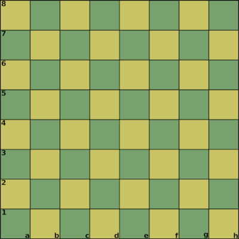

### The battle environment

A maximum of three pawns can be placed on top of each other anywhere on the board.

Think of the environment as three boards stacked on top of each other.

### Game notation

Chess notation is used to identify board locations.

This is extended for Nerva by using the following syntax to identify the stacked boards:

[row][column]_[board] - A pawn is placed on the board.

* [row] From a to h

* [column] From 1 to 8

* [board] From 1 to 3

    Board 1 is the normal chess board

    This is how we identify the pieces on the 3 stacked boards

[row][column]_[board] -> [row][column]_[board] - Attack notation

[K]_[row][column]_[board] - King reveal.

[-K]_[row][column]_[board] - King is captured, game over.

Examples:

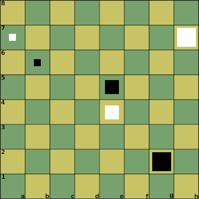

* Notation:

 1. h7_1 2. g2_1 3. e4_2 4. e5_2 5. a7_3 6. b6_3

## The pieces

### The pawns

On a board tile, stack the pieces in this order: Large pawn, Medium pawn, Small pawn.

Thinking in terms of stacked boards:

Board 1 uses the large pawns, board 2 uses the medium pawns, and board 3 uses the small pawns.

Examples:

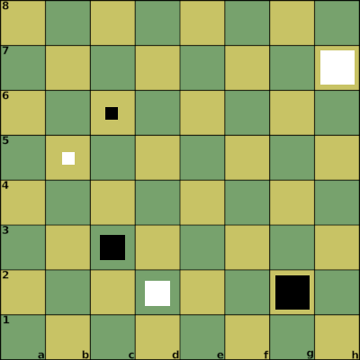

* Notation:

1. d2_2 2. c3_2 3. h7_1 4. g2_1 5. b5_3 6.c6_3

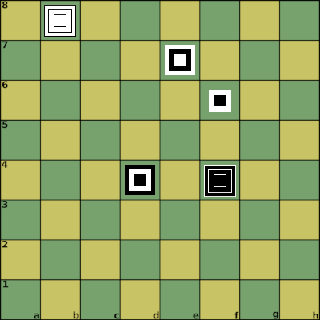

* Notation:

1. b8_1 2. f4_1 3. b8_2 4. f4_2 5. b8_3 6. f4_3 7. f6_2 8. f6_3 9. e7_3 10. e7_2 11. e7_1 12. d4_1 13. d4_2 14. d4_3

#### White

96 pawns and the white king.

#### Black

96 pawns and the black king.

#### Properties

Each pawn has 1 attack point and 1 defense point.

If a pawn is at c3, the adjacent tiles are:

b2 c2 d2 d3 d4 b4 c4 b3

The attack will happen on these adjacent tiles on the same board.

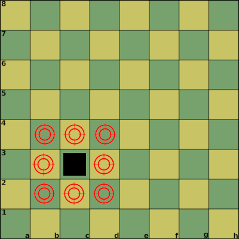

More details in the rules of linking, defending, attacking, stacking sections. 

### The king

The king has no attack/defense points.

## The rules of placement

### Setup

The game starts with an empty board.

Each player gets their 96 pawns and their king.

The White player places the first pawn on the board. 

The pawns can be placed on any empty tile.

A maximum of 3 pawns can be stacked on a tile.

### King location

The king's location is hidden from the enemy player.

Each player decides at the beginning where their king will be located and keeps the information to themselves.

The chosen location can be anywhere on the 3 boards, use the game notation.

Each player will write the position on a piece of paper.

When a player places a pawn on the king's position, the king will be revealed.

The player knows the location and will place his king on the board.

In the unlikely event of both players choosing the same king location:

* place the white king in the location when revealed

* play normally as if both kings are in that location 

Example:

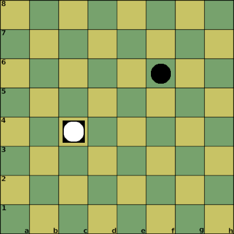

Both kings are revealed.

* Notation:

1. K_c4_2 2. K_f6_1

### Game started

The White player places a pawn, and then the players take turns placing pawns.

The game is over when one king is captured or all pawns are placed. 

## The rules of linking

Any two adjacent friendly pieces are linked, they share attack or defense points.

There are 2 types of linking:

* Attack

  A pawn will share an attack point to any diagonal friendly pawn.

  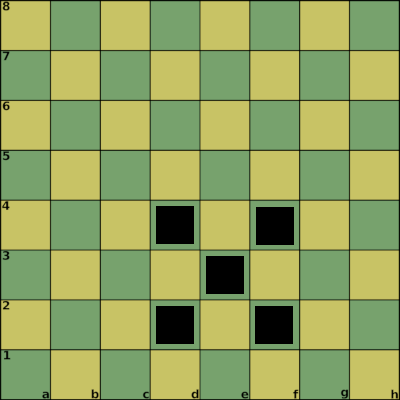

  Notation:

  1. e3_1 2. d4_1 3. f4_1 4. f2_1 5. d2_1

  Properties:

  | Position | Attack Points | Defense Points |
  | :--- | :--- | :--- |
  | e3_1 | 5 | 1 |
  | d4_1 | 2 | 1 |
  | f4_1 | 2 | 1 |
  | f2_1 | 2 | 1 |
  | d2_1 | 2 | 1 |
  
* Defense
  
  A pawn will share a defense point to any friendly pawns placed on the horizontal, vertical positions.

  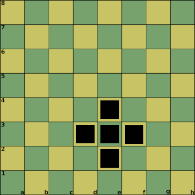

  Notation:

  1. e3_1 2. e4_1 3. f3_1 4. e2_1 5. d3_1

  Properties:

  | Position | Attack Points | Defense Points |
  | :--- | :--- | :--- |
  | e3_1 | 1 | 5 |
  | d4_1 | 1 | 2 |
  | f4_1 | 1 | 2 |
  | f2_1 | 1 | 2 |
  | d2_1 | 1 | 2 |

## The rules of defending

A pawn will add a defense point to adjacent horizontal, vertical friendly piece on the same board.

If a pawn is at c3, the adjacent tiles are:

c4 d3 c2 b3

Any friendly pawn on these positions will receive an additional defense point from the c3 pawn.

c3_1 and d3_1 pawns both have 2 defense points.

Examples:

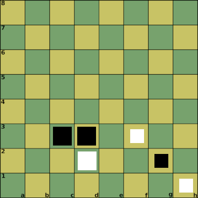

* Case 1

  | Position | Attack Points | Defense Points |
  | :--- | :--- | :--- |
  | f3_2 | 1 | 1 |
  | g2_2 | 1 | 1 |
  | h1_2 | 1 | 1 |

  h1_2 -> g2_2 : attack successful (2 vs 1)

* Case 2

  | Position | Attack Points | Defense Points |
  | :--- | :--- | :--- |
  | d2_1 | 1 | 1 |
  | d3_1 | 1 | 2 |
  | c3_1 | 1 | 2 |

  d2_1 -> d3_1 : failed attack (1 vs 2)

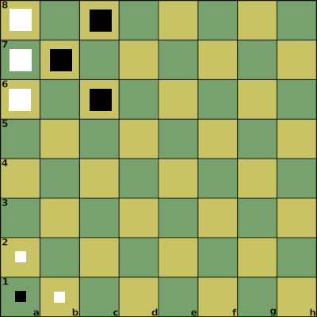

* Case 1

  | Position | Attack Points | Defense Points |
  | :--- | :--- | :--- |
  | a1_3 | 1 | 1 |
  | b1_3 | 2 | 1 |
  | a2_3 | 2 | 1 |

  a1_3 -> b1_3 : failed attack (1 vs 1)

* Case 2

  | Position | Attack Points | Defense Points |
  | :--- | :--- | :--- |
  | a8_2 | 1 | 2 |
  | a7_2 | 1 | 3 |
  | a6_2 | 1 | 2 |
  | c8_2 | 1 | 1 |
  | b7_2 | 3 | 1 |
  | c6_2 | 1 | 1 |

  b7_2 -> a7_2 : failed attack (3 vs 3)

  b7_2 -> a8_2 : successful attack (3 vs 2)

  a6_2 -> b7_2 : failed attack (1 vs 3)

## The rules of attacking

The rules of linking apply to all pawns.

A pawn will add an attack point to all adjacent enemy pawns (or king) on the same board.

Adjacent enemy pawns can be attacked.

An attack will be declared by the player, each attack takes a turn.

If the attack points are higher than the defense points on a particular pawn, the attack will be successful.

The pawn will be removed from the board and replaced by another pawn from the attacker.

If you make a mistake and make an unsuccessful attack, the turn will change.

Examples:

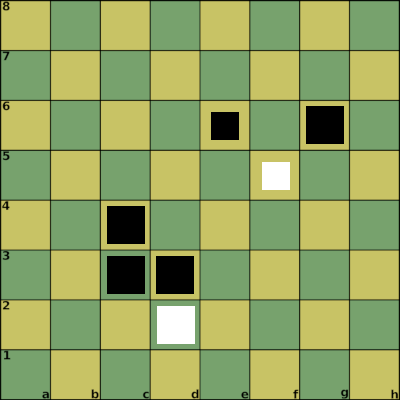

* Case 1

  | Position | Attack Points | Defense Points |
  | :--- | :--- | :--- |
  | f5_2 | 1 | 1 |
  | e6_2 | 1 | 1 |
  | g6_1 | 1 | 1 |

  e6_2 -> f5_2 : failed attack (1 vs 1)

  g6_1 Black pawn is on another board, cannot attack.

* Case 2

  | Position | Attack Points | Defense Points |
  | :--- | :--- | :--- |
  | d2_1 | 1 | 1 |
  | d3_1 | 2 | 2 |
  | c3_1 | 1 | 3 |
  | c4_1 | 2 | 2 |

  d3_1 -> d2_1 : successful attack (2 vs 1)

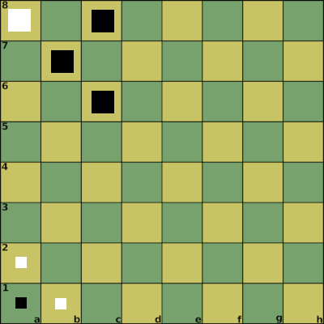

* Case 1

  | Position | Attack Points | Defense Points |
  | :--- | :--- | :--- |
  | a1_3 | 1 | 1 |
  | b1_3 | 2 | 1 |
  | a2_3 | 2 | 1 |

  b1_3 -> a1_3 : successful attack (2 vs 1)

* Case 2

  | Position | Attack Points | Defense Points |
  | :--- | :--- | :--- |
  | a8_2 | 1 | 1 |
  | c8_2 | 2 | 1 |
  | b7_2 | 3 | 1 |
  | c6_2 | 2 | 1 |

  b7_2 -> a8_2 : successful attack (3 vs 1)

### The ambush

An ambush is the situation when a piece is attacked on both diagonals by the enemy.

The attacker receives an +1 attack point bonus.

On succesfull ambush 3 attack points are applied.

The counter is to place a piece on the upper level.

In this case the ambush will fail and the +1 bonus doesnt apply anymore.

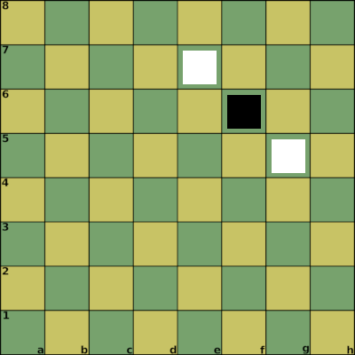

* Case 1

  | Position | Attack Points | Defense Points |
  | :--- | :--- | :--- |
  | e7_1 | 1 | 1 |
  | f6_1 | 1 | 1 |
  | g5_1 | 1 | 1 |

  e7_1 -> f6_1 : successful attack (3 vs 1) 

## The rules of stacking

When 3 pawns from the same player occupy the same position on all 3 boards (a stack of 3 pawns),

then each receives 3 defense and 3 attack points.

When such a stack is formed, the existing pawn attack/defense points will be replaced with 3.

Be carefull with this, the number of defense points could be higher and it will be reseted to 3 in this case.

Example:

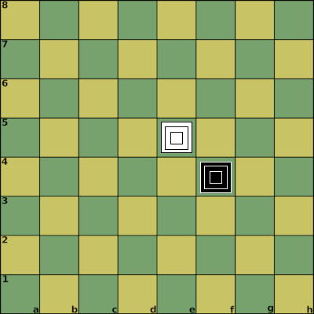

* Notation
1. f4_1 2. e5_1 3. f4_2 4. e5_2 5. f4_3 6. e5_3

## Goal 

The goal is to reveal and capture the enemy king.

## Endgame

Once a king is revealed, the player will place the king on the board.

The king has 0 attack and 0 defense points, the rules of linking apply in the same way.

While the king is not yet revealed, the player has the option to add some defenses to the king's location.

The game will be over if an attack is successful on a king (king is captured).

Example:

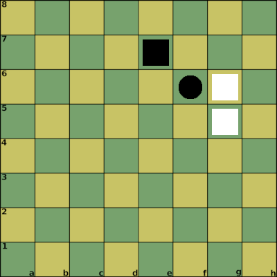

* Notation

1. K_f6_1 2. g6_1 -> f6_1 3. -K_f6_1

Black king is revealed and then captured, game is over. 

## Credits, contact

Afrasinei Alexandru Iulian

Email:

alexandruafrasinei@gmail.com

