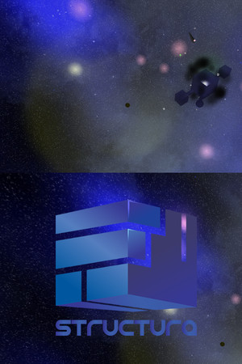
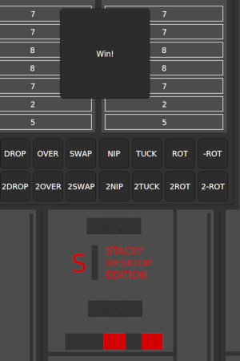

## Welcome

 
GreenGolem is a one man game development shop.

Im a programmer by trade,
with a very old hobby for game development.

My first introduction to programming was on a z80 clone from my country (Romania),
learning BASIC and creating some small games.

I created this site to show my work, and hope some people will find my creations interesting.

My belief is that games should be meaningful experiences, used to learn things and tell stories.

### Games

| [Structura](https://greengolem.github.io/Structura) | [Stacky Desktop Edition](https://greengolem.github.io/StackyDesktopEdition) |
| --- | --- |
|  |  |

### Contact

&nbsp;&nbsp;&nbsp;&nbsp;greengolem.net@gmail.com

