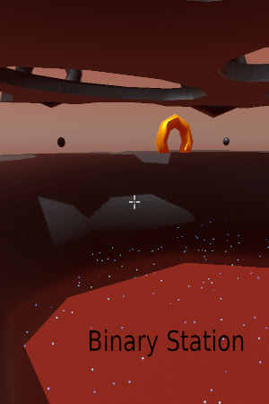
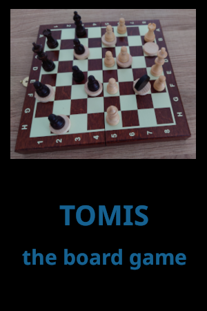

## Welcome

 
BinaryStation is a one man game development shop.

Im a programmer by trade,
with a very old hobby for game development.

My first introduction to programming was on a z80 clone,
learning BASIC and creating some small games.

I created this site to show my work, and hope people will find my creations interesting.

 

### Contact

&nbsp;&nbsp;&nbsp;&nbsp;<binary.station.studio@gmail.com>

&nbsp;&nbsp;&nbsp;&nbsp;[join the discord forum](https://discord.com/invite/VnKhjvsRVr)

### Videos

&nbsp;&nbsp;&nbsp;&nbsp;You tube game trailers and videos:

&nbsp;&nbsp;&nbsp;&nbsp;[BinaryStationStudio](https://www.youtube.com/@binarystationstudio)

 

### Games on Steam

| [Structura](https://binary-station.github.io/Structura) | [Stacky Desktop Edition](https://binary-station.github.io/StackyDesktopEdition) |
| --- | --- |
|   |  |

| [Binary Station](https://binary-station.github.io/BinaryStation) | [The BASIC Preservation Society](https://binary-station.github.io/Unknown)
| --- | --- |
|  | 

### Free games

| [Nerva](https://binary-station.github.io/Nerva) | [Unknown](https://binary-station.github.io/Unknown)
| --- | --- |
|  | 

### Board games

| [Nerva](https://binary-station.github.io/NervaBoardGame) | [Tomis](https://binary-station.github.io/Tomis)
| --- | --- |
|  | 

### Apps/Libs

| [Pace Lib](https://binary-station.github.io/PaceLib) | [Slicer](https://binary-station.github.io/Slicer)
| --- | --- |
|  | 

### Tutorials

| [Godot 4](https://binary-station.github.io/Godot4) | [SDL3](https://binary-station.github.io/SDL3)
| --- | --- |
|  | 
