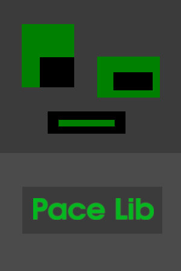

## Welcome

 
BinaryStation is a one man game development shop.

Im a programmer by trade,
with a very old hobby for game development.

My first introduction to programming was on a z80 clone,
learning BASIC and creating some small games.

I created this site to show my work, and hope people will find my creations interesting.

 

### Games

| [Structura](https://binary-station.github.io/Structura) | [Stacky Desktop Edition](https://binary-station.github.io/StackyDesktopEdition) |
| --- | --- |
|   |  |

| [Logos Island](https://binary-station.github.io/LogosIsland) | [Tomis boardgame](https://binary-station.github.io/Tomis)
| --- | --- |
|  | 

### Apps/Libs

| [Pace Lib](https://binary-station.github.io/PaceLib) | [Unknown](https://binary-station.github.io/LogosIsland)
| --- | --- |
|  | 

### Contact

&nbsp;&nbsp;&nbsp;&nbsp;greengolem.net@gmail.com

